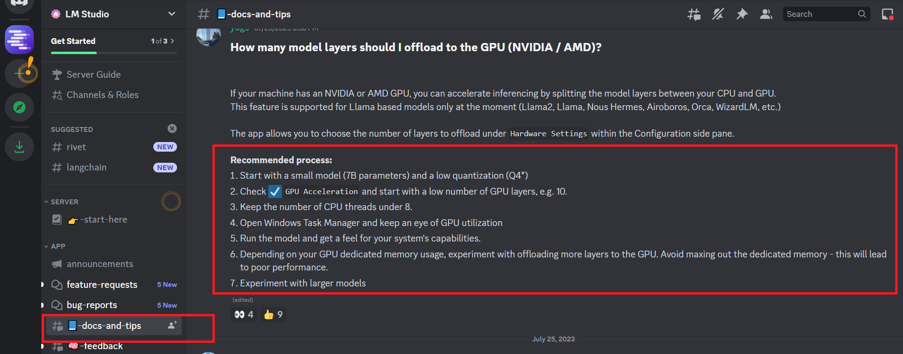

Приглашаю в Телеграм общаться по это теме: https://t.me/AiExp01

# LMBot_01
# LM Studio: Chat Bot based on Open Source LLM!

Пример-заготовка для нейро-помощника, основанном на подходе **RAG** (Retrieval-Augmented Generation).

Использованы только **Open Source** компоненты: 

1. Локальный сервер от **LM Studio**

2. Вместо OpenAI  Embeddings - **HuggingFaceEmbeddings** с моделью 'sentence-transformers/all-MiniLM-L6-v2'

3. Вместо GPT-4 - модель: **IlyaGusev/saiga_mistral_7b_gguf/model-q8_0.gguf**

## LM Studio
В качестве сервера с LLM (Large language model) используется продукт LM Studio: https://lmstudio.ai/

### Скришот про настройку LM Studio

### Скришот про размеры моделей и требуемые GPU

### Версия LM Studio под Linux
На текущий момент чтобы найти версию под Linux, нужно к ним на Discord зайти и дать согласие на beta, тогда в чате видна ветка linux-beta-2

Приглашаю в Телеграм общаться по это теме: https://t.me/AiExp01
